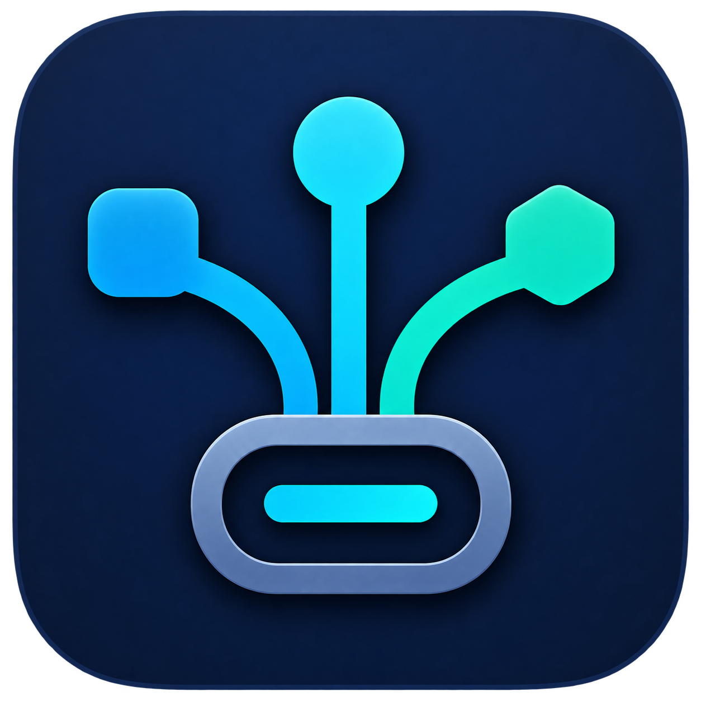

# PortGlance



PortGlance is a native macOS menu-bar utility for inspecting connected USB,
Thunderbolt and USB4 hardware.

PortGlance began with the MIT-licensed source of
[rafaelSwi/MenuBarUSB](https://github.com/rafaelSwi/MenuBarUSB). That original
idea and source authorship remain explicitly credited, and the original
copyright notice remains in the license. PortGlance itself is developed and
maintained independently.

> [!IMPORTANT]
> PortGlance is not an official successor to MenuBarUSB, an official
> continuation of it or a version endorsed by its original author. There is no
> collaboration or affiliation with the original author, who is not involved
> in PortGlance development, maintenance, support or releases. GitHub lists
> upstream author accounts under **Contributors** only because this repository
> preserves the earlier source history.

## Highlights

- USB devices and topology-owned USB hubs in independently collapsible groups;
  Thunderbolt devices remain in the overall count but appear only with their
  physical ports
- Thunderbolt and USB4 devices, including negotiated link speed and protocol
- Physical Thunderbolt/USB4 host ports with occupancy, attached device and
  negotiated or maximum link speed
- External Thunderbolt/USB4 ports are detected from dock topology and grouped
  by their owning device; USB devices connected there remain under USB Devices
- USB-C Billboard interfaces are identified as companion interfaces, so compatible Thunderbolt docks are not listed twice
- Optional local Ethernet-link indicator; network traffic monitoring is not included
- Compact device-first view without saved per-device customizations
- No bundled audio, custom hardware sound or donation functionality
- No telemetry, analytics, crash reporting or network requests; see
  [PRIVACY.md](PRIVACY.md)

## Compatibility

The current release, **PortGlance 0.3.0**, is a **Universal** app for Apple
Silicon (`arm64`) and Intel (`x86_64`) Macs running macOS 13 or newer. Automated
checks run natively on both architectures. The physical Intel-Mac observations
and the hardware cases that still apply after discovery changes are documented
in [TESTING.md](TESTING.md).

The legacy bundle identifier `de.r3d.menubarusb.tb` is intentionally retained
so existing installations keep their preferences and login-item identity.

## Build and test

Open `PortGlance.xcodeproj` in Xcode, or use the local checks:

```bash
./script/verify.sh
./script/build_and_run.sh --verify
```

Hardware acceptance cases and the release workflow are documented in
[TESTING.md](TESTING.md) and [RELEASE.md](RELEASE.md).

## License and origin

PortGlance is distributed under the [MIT License](LICENSE). The original
copyright notice and license terms are preserved. This credits the licensed
source origin and does not imply collaboration, endorsement or successor
status.

---

# PortGlance – Deutsch


PortGlance ist ein natives macOS-Menüleistenprogramm zur Anzeige
angeschlossener USB-, Thunderbolt- und USB4-Hardware.

PortGlance entstand auf Grundlage des MIT-lizenzierten Quellcodes von
[rafaelSwi/MenuBarUSB](https://github.com/rafaelSwi/MenuBarUSB). Die
ursprüngliche Idee und Urheberschaft am Ausgangscode werden ausdrücklich
genannt; der ursprüngliche Copyright-Hinweis bleibt in der Lizenz erhalten.
PortGlance selbst wird unabhängig entwickelt und gepflegt.

> [!IMPORTANT]
> PortGlance ist weder ein offizieller Nachfolger noch eine offizielle
> Fortführung von MenuBarUSB und auch keine vom ursprünglichen Autor bestätigte
> Variante. Es bestehen weder Zusammenarbeit noch Zugehörigkeit; der
> ursprüngliche Autor ist an Entwicklung, Pflege, Support und Releases von
> PortGlance nicht beteiligt. GitHub führt dessen Konten ausschließlich wegen
> der erhaltenen früheren Quellcodehistorie unter **Contributors** auf.

## Wichtige Funktionen

- USB-Geräte und nach ihrem Topologie-Besitzer gegliederte USB-Hubs in
  unabhängig einklappbaren Gruppen; Thunderbolt-Geräte bleiben im
  Gesamtzähler, erscheinen aber nur an ihren physischen Ports
- Thunderbolt- und USB4-Geräte einschließlich ausgehandelter Link-Geschwindigkeit
  und Protokoll
- Physische Thunderbolt-/USB4-Host-Ports mit Belegung, angeschlossenem Gerät
  und ausgehandelter beziehungsweise maximaler Link-Geschwindigkeit
- Externe Thunderbolt-/USB4-Ports werden aus der Dock-Topologie erkannt und
  nach ihrem Gerät gruppiert; dort angeschlossene USB-Geräte bleiben unter
  USB-Geräte
- USB-C-Billboard-Schnittstellen werden als Begleitschnittstellen erkannt,
  sodass kompatible Thunderbolt-Docks nicht doppelt erscheinen
- Optionale lokale Ethernet-Link-Anzeige; eine Überwachung des Netzwerkverkehrs
  ist nicht enthalten
- Kompakte, geräteorientierte Ansicht ohne gespeicherte Anpassungen je Gerät
- Keine eingebundenen Audiodateien, eigenen Hardware-Sounds oder
  Spendenfunktionen
- Keine Telemetrie, Analyse, Crash-Berichte oder Netzwerkanfragen; siehe
  [PRIVACY.md](PRIVACY.md)

## Kompatibilität

Der aktuelle Release **PortGlance 0.3.0** ist eine **Universal-App** für
Apple-Silicon- (`arm64`) und Intel-Macs (`x86_64`) mit macOS 13 oder neuer. Die
automatischen Prüfungen laufen nativ auf beiden Architekturen. Die physischen
Beobachtungen auf einem Intel-Mac und die nach Änderungen an der
Geräteerkennung weiterhin erforderlichen Hardware-Abnahmen sind in
[TESTING.md](TESTING.md) dokumentiert.

Die bisherige Bundle-ID `de.r3d.menubarusb.tb` bleibt absichtlich erhalten,
damit vorhandene Installationen ihre Einstellungen und die Identität des
Anmeldeobjekts behalten.

## Bauen und testen

`PortGlance.xcodeproj` in Xcode öffnen oder die lokalen Prüfungen ausführen:

```bash
./script/verify.sh
./script/build_and_run.sh --verify
```

Hardware-Abnahmefälle und der Release-Ablauf sind in
[TESTING.md](TESTING.md) und [RELEASE.md](RELEASE.md) dokumentiert.

## Lizenz und Herkunft

PortGlance wird unter der [MIT-Lizenz](LICENSE) vertrieben. Der ursprüngliche
Copyright-Hinweis und die Lizenzbedingungen bleiben erhalten. Damit wird die
lizenzierte Herkunft des Ausgangscodes gewürdigt; eine Zusammenarbeit,
Bestätigung oder Nachfolgestellung ist damit nicht verbunden.
